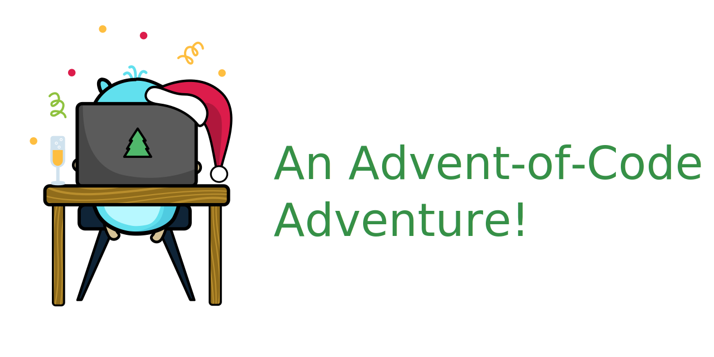

# Advent of code

## Improving my Go skills with advent-of-code puzzles.




*asset from the awesome [free-gophers-pack](https://github.com/MariaLetta/free-gophers-pack)*


For more information on what is advent of code checkout the official site:
[adventofcode.com](https://adventofcode.com/)


## Run the scripts

```bash
# Go to script
cd <YEAR>/<DAY>

# Run part 1
cat input | go run . -p 1

# Run part 1
cat input | go run . -p 2
```
